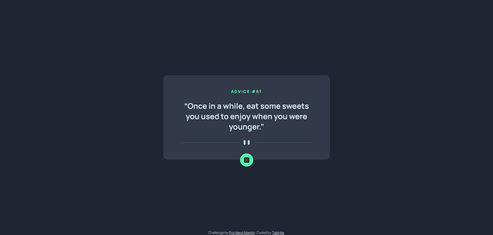

# Frontend Mentor - Advice generator app solution

This is a solution to the [Advice generator app challenge on Frontend Mentor](https://www.frontendmentor.io/challenges/advice-generator-app-QdUG-13db). Frontend Mentor challenges help you improve your coding skills by building realistic projects.

## Table of contents

- [Overview](#overview)
  - [The challenge](#the-challenge)
  - [Screenshot](#screenshot)
  - [Links](#links)
- [My process](#my-process)
  - [Built with](#built-with)
  - [What I learned](#what-i-learned)
  - [Continued development](#continued-development)
  - [Useful resources](#useful-resources)
- [Author](#author)

## Overview

### The challenge

Users should be able to:

- Get advice and reroll advice

### Screenshot



### Links

- Live Site URL: [Pages](https://tabinka.github.io/AdviceGeneratorApp/)

## My process

### Built with

- Semantic HTML5 markup
- CSS custom properties
- Sass
- Vanilla JavaScript for fetching API and rolling new advice
- Flexbox
- Mobile-first workflow

### What I learned

Use this section to recap over some of your major learnings while working through this project. Writing these out and providing code samples of areas you want to highlight is a great way to reinforce your own knowledge.

```js
function getAdvice(){
    let fetchRes = fetch(
        "https://api.adviceslip.com/advice");
    fetchRes.then(res => ...
}
```

### Continued development

Definetely my main focus will be sharpening my skills in JS and start more focusing on creating functions and using JS frameworks.

### Useful resources

- [FreeCodeCamp](https://www.freecodecamp.org/news/javascript-dom-events-onclick-and-onload/) - This helped me with alternative onclick and onload events for my JS function
- [DigitalOcean](https://www.digitalocean.com/community/tutorials/how-to-use-the-javascript-fetch-api-to-get-data) - Source where I find help on fetching URL in JS

## Author

- Github - [Tabinka](https://github.com/Tabinka)
- Frontend Mentor - [@Tabinka](https://www.frontendmentor.io/profile/Tabinka)
